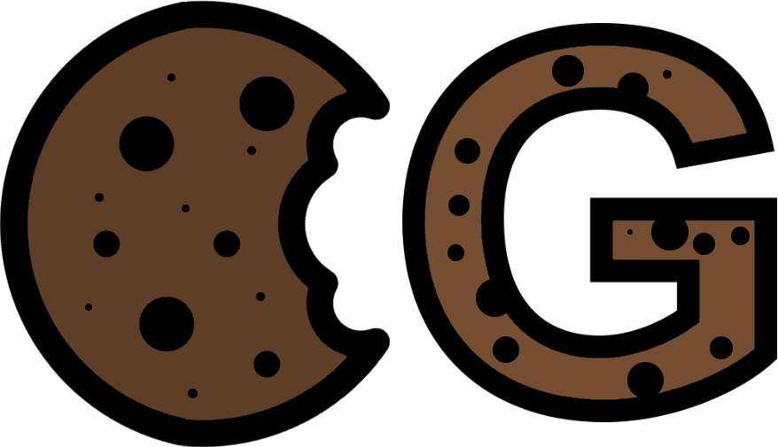

# CockyGrabber

  

CockyGrabber is a C# library that simplifies the collection of browser information such as cookies, logins, and more. It is also very *easy* to use and allows you to capture browser information without any special knowledge.

> *CockyGrabber is still in development and will receive future updates*!  
> If you got **requests** or find any **bugs**, please open an Issue!

## Documentation: Table Of Contents

* [Usage](./docs/usage.md)
    * [Importing CockyGrabber](./docs/usage.md#importing-cockygrabber)
    * [Grabbing Cookies](./docs/usage.md#grabbing-cookies)
        * [Grabbing Cookies from Chromium/Blink-based Browsers](./docs/usage.md#grabbing-cookies-from-chromiumblink-based-browsers)
        * [Grabbing Cookies from Gecko-based Browsers](./docs/usage.md#grabbing-cookies-from-gecko-based-browsers)
    * [Grabbing Logins](./docs/usage.md#grabbing-logins)
        * [Grabbing Logins from Chromium/Blink-based Browsers](./docs/usage.md#grabbing-logins-from-chromiumblink-based-browsers)
        * [Grabbing Logins from Gecko-based Browsers](./docs/usage.md#grabbing-logins-from-gecko-based-browsers)
    * [Grabbing data from multiple Browsers](./docs/usage.md#grabbing-data-from-multiple-browsers)
    * [Getting specific data by Headers](./docs/usage.md#getting-specific-data-by-headers)
    * [Catching Exceptions](./docs/usage.md#catching-exceptions)
    * [Adding Custom Browsers](./docs/usage.md#adding-custom-browsers)
        * [CustomBlinkGrabber Example](./docs/usage.md#customblinkgrabber-example)
        * [CustomGeckoGrabber Example](./docs/usage.md#customgeckograbber-example)

 

## What's Next

1. Adding more things to grab like credit cards, form history, extensions, ...
2. Async Funtions
3. Creating an NuGet Package
4. Adding custom Functions that replace the packages
5. Creating a minimalized File that anyone can easily implement in their Project without referencing CockyGrabber itself
6. Improving the documentation
7. Adding support for more browsers
8. Creating a UnitTest (maybe?)
9. Adding Events

## End

That's it for now! 
I hope you like this little project! ^^
